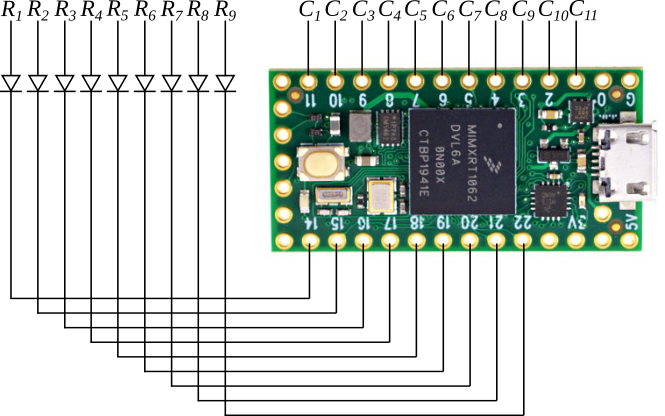
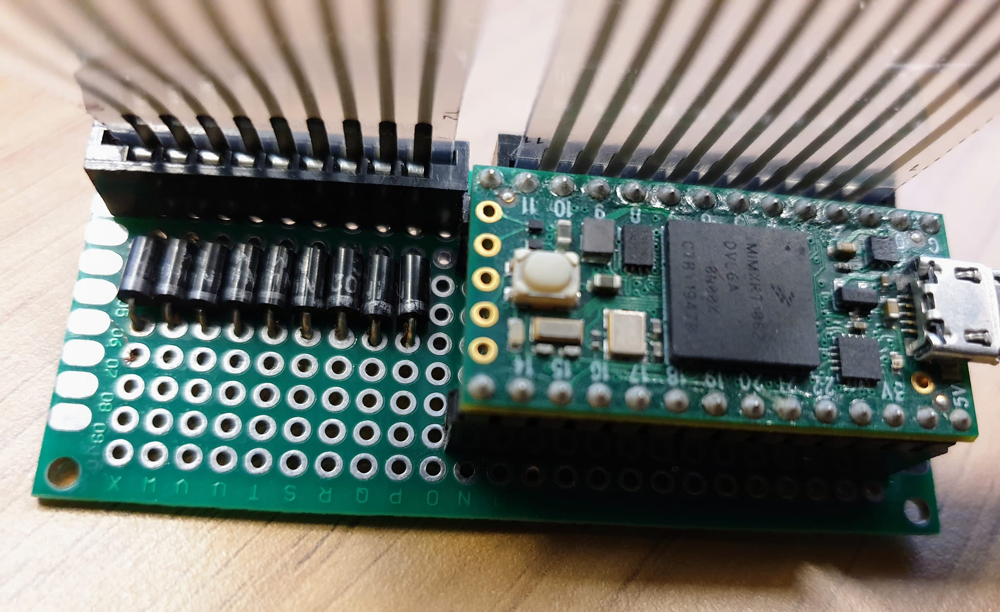

# QL Keyboard

This is a Sinclair QL Keyboard USB Interface using a Teensy USB Development board.

The keyboard is connected by two ribbon cables in a 9 x 11 matrix. The main keyboard uses rows 1 to 8 and columns 3 to 10. The modifier keys, `ctrl`, `shift` and `alt` have a dedicated row, 9, which is used with columns 1, 2 and 11.

Note that the QL Technical Manual has a number of errors in the keyboard matrix diagram. Corrections to the original version are highlighted in yellow.

## Physical Interface

The physical interface is a simple design, with the QL ribbon connectors, the Teensy board, and some diodes to ensure keys can't cross interfere.

The rows act as outputs, connected across the diodes to pins 14 to 22, and the columns act as inputs connected directly to pins 1 to 11.

I carried out some initial prototyping using a breadboard circuit. However, this was too tall to fit inside the QL case, so I moved to a hand soldered prototype circuit board.

## Interface Software

The keyboard program runs on the Teensy and makes it look like a regular USB keyboard to the attached computer.

The inputs are set to a `high` state by default. The program loop outputs a `low` on each row pin in turn. When the key is pressed, this will pull the relevant input column `low`.

The USB key scancodes are stored in an array, and sent when the relevant key matrix position is pressed.

## Future Development

A number of features are planned for the future.

### PS/2 Interface

Although the USB interface is useful for modern computers, many retro computers support PS/2 keyboards. This would be especially useful for controlling new QL variants, most notably the Q68.

The Teensy board 24 digital IO pins (there some extra ones that could potentially be used, but they require soldering onto pads on the back of the board). 20 of these are needed for the QL keyboard ribbon connectors. Pin 13 controls the on board LED, which limits it's use, but 3 are still available. For PS/2, only 2 IO pins are required, for clock and data, so it should be straightforward to build the physical interface. Some work would be needed to develop the software, which sends scancodes in a very different way to the USB interface. PS2 also uses completely different scancodes to USB, so those would need to be set up.

### PCB Creation

When the design is finalised, I would like to get it produced as a proper printed circuit board. I will share the PCB design, and will be happy to offer a limited number of boards to other people.
