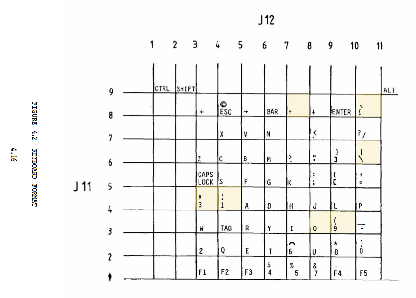

# QL Keyboard

This is a QL Keyboard USB Interface ussing a Teensy USB Development board.

The keyboard is connected by two ribbon cables in a 9 x 11 matrix. The main keyboard uses rows 1 to 8 and columns 3 to 10. The modifier keys, `ctrl`, `shift` and `alt` have a dedicated row, 9, which is used with columns 1, 2 and 11.

Note that the QL Technical Manual has a number of errors in the keyboard matrix diagram. Corrections to the original version are highlighted in yellow.

# Physical Interface

The physical interface is a simple design, with the QL ribbon connectors, the Teensy board, and some diodes to ensure keys can't cross interfere.

The rows act as outputs, connected across the diodes to pins 14 to 22, and the columns act as inputs connected directly to pins 1 to 11.

Diagrams will be added soon.

# Interface Software

The keyboard program runs on the Teensy and makes it look like a regular USB keyboard.

The inputs are set to a `high` state by default. The program loop outputs a `low` on each row pin in turn. When the key is pressed, this will pull the relevant input column `low`.

The USB key scancodes are stored in an array, and sent when the relevant key matrix position is pressed.
